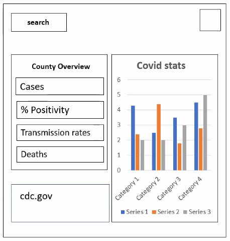

# Covid EXPosure

## Description

A website that offers users (i.e. travelers) insight information into what's going on and around their County/State.
Users will be able to see real time data over a period of time of how and where COVID has increased or decreased in both their area and surrounding areas in order to plan their travels accordingly for the safest option. The user simply clicks on the county and scrolls down to locate the information that is required.

## Technologies
*HTML
*CSS
*JavaScript
*JQuery
*UI
*Bulma
*API

# Website 
https://zk229.github.io/project-1/

# Screenshot 

##User Story

AS A traveler in the state of Florida I am concerned for contracting COVID-19. I WANT to be able to determine my risk for exposure as I travel to different counties. 

##Acceptance Criteria

-To create a real-world front-end application to showcase to potential employers.
-Application must use a CSS framework other than Bootstrap.
-Application must be deployed to GitHub Pages.
-Application must be interactive (i.e. accept and respond to user input).
-Use at least two server-side APIs.
-Application must NOT use alerts, confirms, or prompts (use modals).
-Application must use client-side storage to store persistent data.
-Application must be responsive.
-Application must have a polished UI.
-The project must have a clean repository that meets quality coding standards (file structure, naming conventions, follows best practices for class/id-naming conventions, indentation, quality comments, etc.).
-Project must have a quality README (with unique name, description, technologies used, screenshot, and link to deployed application).
-Project must be added to the portfolio that was created in a previous assignment.

## Contributions 

by Zach Kirsche, Marc St louis, Georges Simon, Jennifer Howard

### Covid Exposure  
