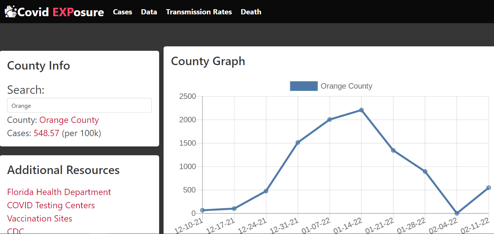
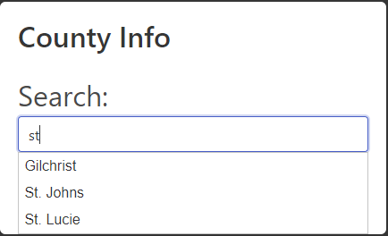
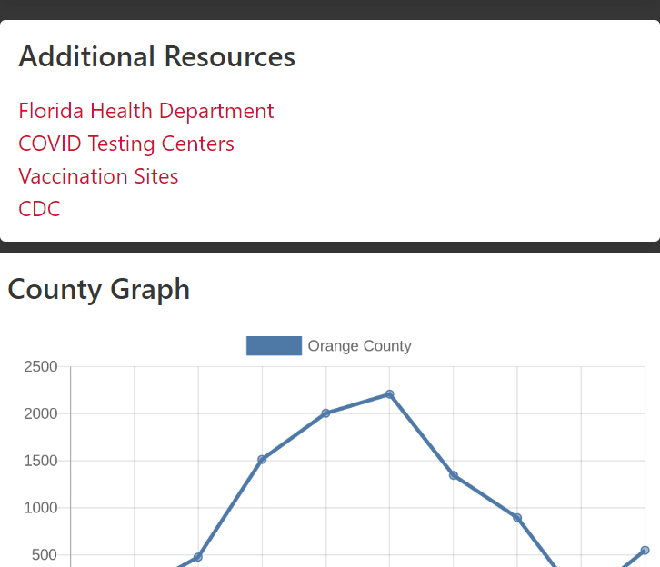

# Covid EXPosure

## Description

A website that offers users (i.e. travelers) insight information into what's going on and around their County/State.
Users will be able to see real time data over a period of time of how and where COVID has increased or decreased in both their area and surrounding areas in order to plan their travels accordingly for the safest option. The user simply clicks on the county and scrolls down to locate the information that is required.

## Technologies
* HTML
* CSS
* JavaScript
* JQuery
* UI
* Bulma
* API

# Website 
https://zk229.github.io/covid-exposure/

# Screenshots 

Desktop view of the website

Counties are automatically suggested to the user based on what they type

The site is mobile-responsive - display is optimized for mobile devices

## User Story

AS A traveler in the state of Florida I am concerned for contracting COVID-19. I WANT to be able to determine my risk for exposure as I travel to different counties. 

## Contributions 

by Zach Kirsche, Marc St louis, Georges Simon, Jennifer Howard

### Covid Exposure  
